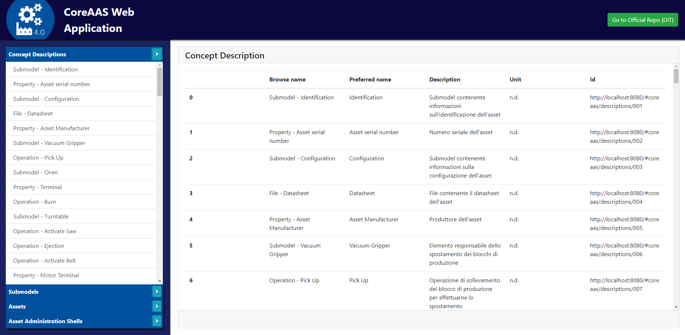

# CoreAAS-based-application
Definition of the digital twin of a smart factory by Asset Administration Shell and an application using it.


## Table of Contents
- [References](#References)
- [Screenshots](#screenshots)
- [Requirements](#Requirements)
- [Dependencies](#Dependencies)
- [Running for test](#Running-for-test)
- [Future developments](#Future-developments)


## References
References available (italian only) at:
- docs/UML


## Screenshots
- **Web Application**



## Requirements
The application has the following requirements (needed to run the project)
Note: this app was successfully tested on Windows 10. The following links refer to Windows 10. If using a different Operative System, it is necessary to search and download the proper software. 
- **OPC UA CoreAAS based Server**:
	1. NodeJS (https://nodejs.org/it/)
	2. Typescript. Open a terminal and write:
		```
		npm install -g typescript
		```
	3. OPC UA CoreAAS Server. Open a terminal and write (from the root folder of the project):
		```
		cd aas_server
		npm install node-opcua-coreaas --save
		```
- **Web Application**:
	1. Nodejs.
	2. Package-json. Open a terminal and write:
		```
		npm install
		```
	3. MongoDB (https://www.mongodb.com/download-center/community)

## Dependencies
The application has the following dependencies (libraries and packages)
- **OPC UA CoreAAS based Server**:
	1. node-opcua-coreaas https://github.com/OPCUAUniCT/node-opcua-coreaas.
- **Web Application**:
	1. AngularJS 1.6.9 https://angularjs.org/.
	2. Bootstrap 4.0.0 https://getbootstrap.com/docs/4.0/getting-started/download/.
	3. FontAwesome 5.6.1 https://fontawesome.com/.
	4. ImageMapster 1.2.10 http://www.outsharked.com/imagemapster/.
	5. Body-parse 1.19.0 (package-json).
	6. Cors 2.8.5 (package-json).
	7. Http-server 0.9.0 (package-json).
	8. Mongodb 3.3.4 (package-json).
	9. Mongoose 5.7.12 (package-json).
	10. Express 4.17.1 (package-json).


## Running for test
After having installed all the requirements it is possible to clone this project and run it by following the next steps. 

#### 1. Clone the project from master branch
- Open a terminal and write:
	```
	git clone https://github.com/Taletex/CoreAAS-based-application
	```

#### 2. Build and run the OPC UA CoreAAS based Server
- Open a terminal and write (from the root folder of the project):
	```
	cd aas_server
	npm run uaIndustryServer
	```

#### 3. Run the Web Application
- MongoDB server. Execute the mongoDB community server previously installed.
- Http-server. Open a terminal and write (from the root folder of the project):
	```
	cd aas_webapp
	http-server -o
	```
   A new browser tab at the address where the web application is running will open.

- NodeJs-server (REST API and DataBase). Open a terminal and write (from the root folder of the project):
	```
	cd aas_webapp
	cd database
	node server.js
	```


## Future developments
- TODO
